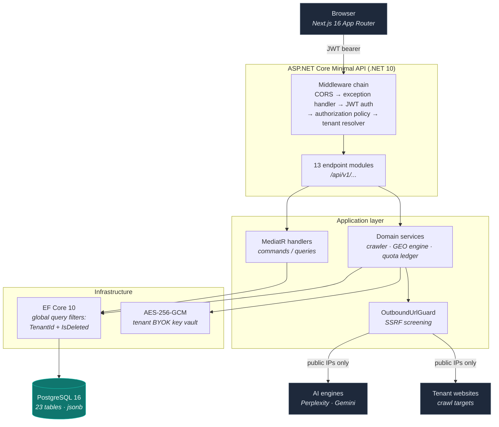

# Akiron SEO

**Multi-tenant B2B SaaS platform for SEO and Generative Engine Optimization (GEO).**

Traditional SEO tools tell you where you rank on Google. They cannot tell you whether
ChatGPT, Perplexity, or Gemini mention your brand when a customer asks them a buying
question. Akiron SEO measures both, and turns the gaps into content work.

[](https://dotnet.microsoft.com/)
[](https://nextjs.org/)
[](https://www.postgresql.org/)
[](https://github.com/yavuzcgg/akiron-seo/actions/workflows/ci.yml)
[](#feature-status)

> ### ⚠️ Active development — not production-ready
>
> This is a work in progress, built in the open. The platform core (multi-tenancy,
> authentication, quota accounting, persistence) is implemented and integration-tested.
> Several product-facing analytics features currently return **simulated data** rather
> than live third-party API results, and are explicitly marked as such in
> [Feature status](#feature-status). There is no billing integration and no background
> job runner yet. Do not deploy this against real customer data.

---

## The problem

An increasing share of commercial search now ends inside an AI assistant instead of a
results page. When someone asks *"which brand makes the most durable motorcycle helmets?"*,
the answer is synthesised by a model — and if your brand is not in that answer, the click
never happens. There is no Search Console for that surface.

Akiron SEO addresses three questions a marketing team cannot currently answer:

1. **Are we cited by AI engines?** Query the engines with real buying-intent prompts,
   parse which brands and URLs they cite, and track share of voice over time.
2. **Is our site even readable by AI crawlers?** Audit `robots.txt` for GPTBot,
   ClaudeBot, PerplexityBot and friends, and generate the JSON-LD and `llms.txt`
   that answer engines consume.
3. **Where is the cheapest win?** When an engine cites a URL on your domain that
   returns 404, that is a page the model already believes should exist. Akiron flags
   these as **Gold Opportunities** and feeds them straight into the AI content writer.

The target customer is the SEO agency: multi-tenant by design, with per-tenant quotas and
a BYOK (bring-your-own-key) model so each tenant supplies their own AI provider keys and
pays their own inference costs.

---

## Architecture

Clean Architecture with strict dependency direction — `Domain` depends on nothing,
`API` depends inward only.



### Engineering decisions worth calling out

**Multi-tenancy is enforced at the ORM, not in handlers.** `AkironDbContext` reflects over
every entity implementing `IMultiTenant` / `ISoftDelete` and installs a global query filter
(`TenantId == CurrentTenantId && !IsDeleted`) generically, so a forgotten `.Where()` in a new
handler cannot leak another tenant's rows. Isolation is covered by integration tests that
run against real PostgreSQL.

**The quota ledger is idempotent and concurrency-safe.** Reservations are keyed on a unique
`JobId`; a duplicate insert violating that index is treated as success rather than an error.
The debit is a single conditional `ExecuteUpdateAsync` guarded by the remaining balance, so
two concurrent jobs cannot overdraw a tenant's monthly token allowance. Refunds atomically
claim the reservation row before crediting, making double-refund impossible.

**Tenant AI provider keys are envelope-encrypted.** Keys are sealed with AES-256-GCM using a
random per-record nonce, stored as `nonce ‖ tag ‖ ciphertext`, and the master key is supplied
only through the environment — never committed.

**Outbound fetches are screened.** Crawl targets and webhook URLs are attacker-controlled
strings. `OutboundUrlGuard` resolves the host and rejects loopback, RFC 1918, carrier-grade
NAT, and link-local addresses — including the `169.254.169.254` cloud metadata endpoint —
before any connection is opened.

---

## Tech stack

| Layer | Technology |
| --- | --- |
| **Backend** | .NET 10 · ASP.NET Core Minimal APIs · Clean Architecture |
| **CQRS** | MediatR 12.4 |
| **Persistence** | EF Core 10 · Npgsql · PostgreSQL 16 (native `jsonb`) |
| **Auth** | JWT bearer + rotating refresh tokens · PBKDF2-HMAC-SHA512 (600k iterations) |
| **Crypto** | AES-256-GCM envelope encryption for tenant BYOK keys |
| **Scheduling** | Cronos (cron expression parsing) |
| **Logging** | Serilog structured logging · RFC 7807 problem details |
| **DNS** | DnsClient (TXT-record domain ownership verification) |
| **Frontend** | Next.js 16 App Router · React 19 · TypeScript 5 (strict) · Tailwind CSS 4 |
| **Testing** | xUnit · Testcontainers for PostgreSQL |
| **Infra** | Docker multi-stage builds · Docker Compose |

---

## Getting started

### Prerequisites

- .NET SDK 10.0
- Node.js 22+
- Docker Desktop (required for the database and the integration test suite)

### Option A — full stack in Docker

```bash
git clone https://github.com/yavuzcgg/akiron-seo.git
cd akiron-seo

cp .env.example .env
# Edit .env and replace every placeholder. Generate the two keys with:
#   openssl rand -base64 48

docker compose up -d --wait
```

Frontend on <http://localhost:3000>, API on <http://localhost:5248>,
health probe at <http://localhost:5248/health>. PostgreSQL is bound to the loopback
interface only, so local tooling can reach it but the network cannot.

> The API **refuses to start** outside Development if `Jwt__SecretKey` or
> `Security__MasterEncryptionKey` is missing, too short, or still an example value.
> That is deliberate — see [`SecretsValidator`](backend/src/Presentation/AkironSeo.API/Security/SecretsValidator.cs).

### Option B — local development

```bash
# 1. Database only
docker compose up -d --wait postgres

# 2. Backend — create the gitignored dev secrets file first
cd backend/src/Presentation/AkironSeo.API
cp appsettings.Development.example.json appsettings.Development.json
cd ../../../
dotnet run --project src/Presentation/AkironSeo.API

# 3. Frontend
cd ../frontend
npm install
npm run dev
```

In Development the API seeds a SuperAdmin account: `admin@akironseo.com` / `Admin123!`.
This seed is skipped in every other environment, so a deployment has no default credentials.

### Configuration

| Variable | Purpose |
| --- | --- |
| `ConnectionStrings__DefaultConnection` | PostgreSQL connection string |
| `Jwt__SecretKey` | Access-token signing key (min. 256 bits) |
| `Security__MasterEncryptionKey` | Derives the AES key protecting tenant BYOK keys |
| `Cors__AllowedOrigins__0` | Origin permitted to call the API with credentials |
| `NEXT_PUBLIC_API_URL` | API base URL — **build-time**, baked into the client bundle |

> Rotating `Security__MasterEncryptionKey` makes all previously stored tenant API keys
> undecryptable. They have to be re-entered.

---

## Screenshots

<!--
  TODO: capture and commit to docs/screenshots/, then uncomment the images below.
  Suggested captures (log in as the seeded SuperAdmin, add one real website first):
    1. dashboard.png       — website list with audit score + the GEO / keyword / competitor cards
    2. audit-report.png    — AuditDetailsModal showing parsed meta tags and score breakdown
    3. geo-intelligence.png— GeoIntelligenceCard citation matrix across engines
    4. admin-panel.png     — SuperAdmin tenant list with quota controls
    5. executive-report.png— the generated printable HTML report

  
  
  
  
-->

_Screenshots are not committed yet._ The UI is a dark-themed Next.js dashboard covering
website management, SEO audits, GEO citation tracking, an AI content writer, and a
SuperAdmin tenant panel.

---

## Feature status

Honest accounting of what is wired to real logic and what is not. Every API response
carries a `dataSource` field (`Live` / `NotConfigured` / `Unavailable` / `Simulated`), and
the dashboard renders a **DEMO DATA** badge for anything that is not a measurement — so a
simulated figure is never presented as a real one.

| Feature | Status | Notes |
| --- | --- | --- |
| Multi-tenant isolation | ✅ Real | EF global query filters, integration-tested |
| JWT auth + refresh rotation | ✅ Real | PBKDF2-HMAC-SHA512, 600k iterations |
| Idempotent quota ledger | ✅ Real | Atomic, concurrency-tested — not yet called by job flows |
| BYOK key encryption | ✅ Real | AES-256-GCM envelope encryption |
| SEO audit + crawler | ⚠️ Partial | Real HTTP fetch and weighted scoring, but **homepage only** — no sitemap or link following |
| robots.txt AI-bot auditor | ✅ Real | Live fetch and parse |
| AEO schema / `llms.txt` generator | ✅ Real | JSON-LD generation |
| GEO citation tracking | ✅ Real | Perplexity and Gemini adapters make real API calls; OpenAI and Anthropic adapters not written yet |
| AI content writer | ✅ Real | Requires a tenant Gemini key; falls back to canned text without one |
| Domain ownership verification | ✅ Real | Meta-tag and DNS TXT, both verified live |
| Executive HTML report | ✅ Real | Server-rendered, HTML-encoded; PDF is browser print |
| Google Search Console analytics | ❌ Simulated | Computed from the audit score — **no Google API integration exists**. Badged in the UI. |
| Keyword rank tracking | ❌ Simulated | Hash-derived positions, no SERP provider. Badged in the UI. |
| Competitor SERP gap analysis | ❌ Simulated | Returns a fixed keyword set. Badged in the UI. |
| Background job runner | ❌ Missing | Cron schedules are computed but nothing executes them |
| Billing / subscriptions | ❌ Missing | Manual B2B renewal only; no payment provider |
| CI | ✅ Real | GitHub Actions: backend build + Testcontainers tests, frontend type-check + build, both Docker images |

---

## Testing

```bash
cd backend
dotnet test
```

The suite spins up a throwaway PostgreSQL 16 container via Testcontainers and applies the
real migrations, so unique indexes, foreign keys, transactions, and row locking behave
exactly as in production. Docker must be running.

Current coverage is deliberately narrow but deep — it targets the two subsystems where a
bug is silent and expensive:

- `QuotaLedgerTests` — idempotency, limit enforcement, concurrent non-overdraw, double-refund prevention
- `TenantIsolationTests` — cross-tenant leakage, soft-delete filtering, partial unique index races

Broader API-level coverage is on the roadmap.

---

## Project structure

```
akiron-seo/
├── backend/
│   ├── src/
│   │   ├── Core/
│   │   │   ├── AkironSeo.Domain/          # Entities, enums, interfaces — zero dependencies
│   │   │   └── AkironSeo.Application/     # CQRS handlers, service contracts, URL guard
│   │   ├── Infrastructure/
│   │   │   └── AkironSeo.Infrastructure/  # DbContext, migrations, crypto, external services
│   │   └── Presentation/
│   │       └── AkironSeo.API/             # Minimal API modules, middleware, auth policies
│   └── tests/
│       └── AkironSeo.IntegrationTests/    # Testcontainers-backed integration suite
├── frontend/
│   └── src/
│       ├── app/                           # App Router pages: /, /login, /register, /dashboard, /admin
│       ├── components/                    # Dashboard cards and modals
│       └── lib/                           # Typed API client, session handling
├── docs/                                  # Architecture, ADRs, changelog, dev notes
└── docker-compose.yml
```

Key reading: [`SYSTEM_ARCHITECTURE.md`](docs/SYSTEM_ARCHITECTURE.md) ·
[`DECISION_LOG.md`](docs/DECISION_LOG.md) (ADRs) ·
[`DEV_NOTES.md`](docs/DEV_NOTES.md) (setup) ·
[`CHANGELOG.md`](docs/CHANGELOG.md)

---

## Roadmap

**Next — a background job runner** so the computed cron schedules actually fire; today
`TrackedKeyword.NextScheduledRun` is written and never read, and every analysis runs inline
in the HTTP request. Alongside it, wiring the quota ledger into the crawl, GEO, and AI
flows and reading real limits from `Plan.LimitsJson` instead of hardcoded constants — the
ledger is implemented and tested but nothing calls it. Then rate limiting on login and
hashed refresh tokens at rest.

**Then — real integrations.** Google Search Console via OAuth first, since the API is free
and it replaces the most misleading simulated feature. A SERP provider for genuine rank
tracking. OpenAI and Anthropic GEO adapters to complete the citation matrix. Real email
delivery and signed, retried webhooks.

**Later — productisation.** Payment integration, a multi-page crawler using a real HTML
parser instead of regex, completing i18n coverage beyond the current 12 translation keys,
fixing light mode, and API-level test coverage via `WebApplicationFactory`.

---

## License

Not yet licensed. All rights reserved.
